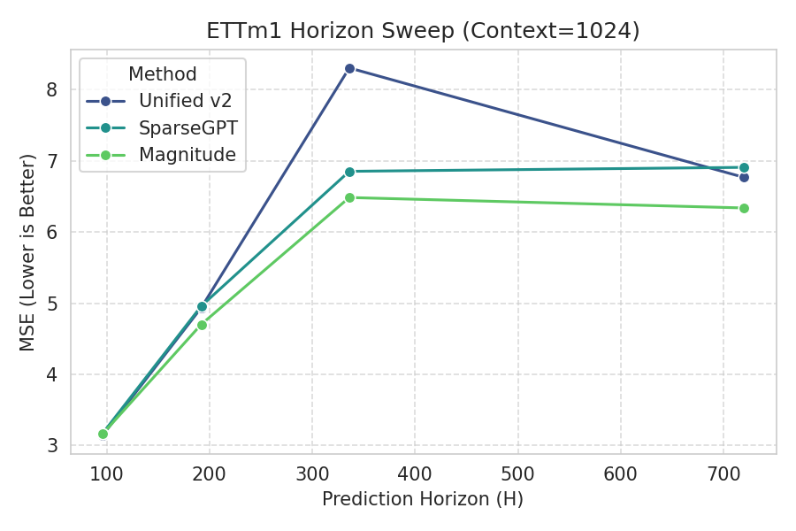
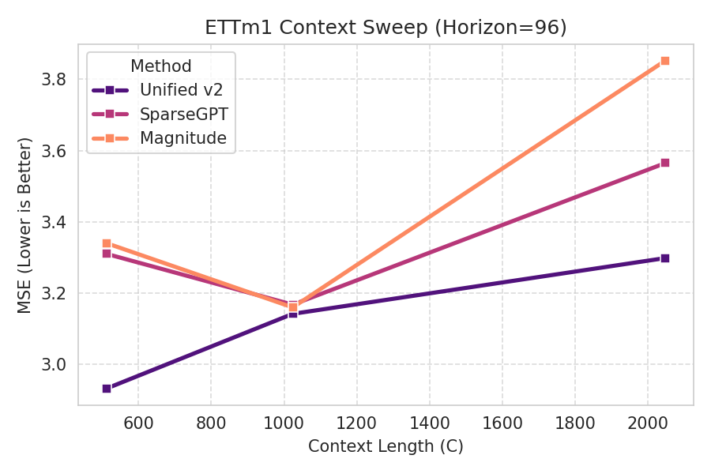
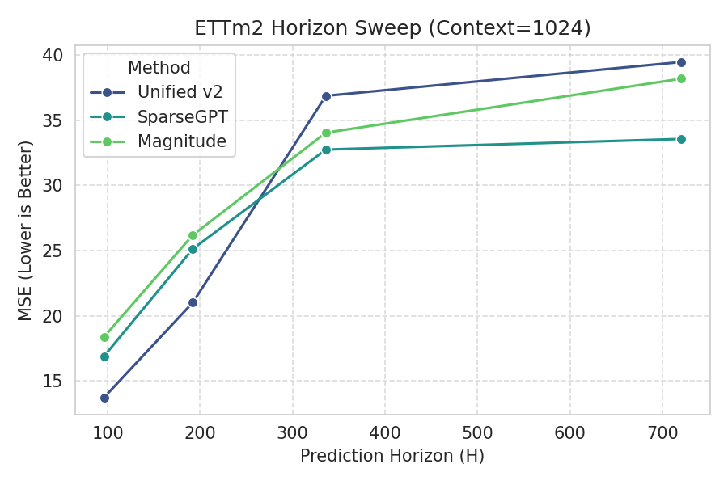
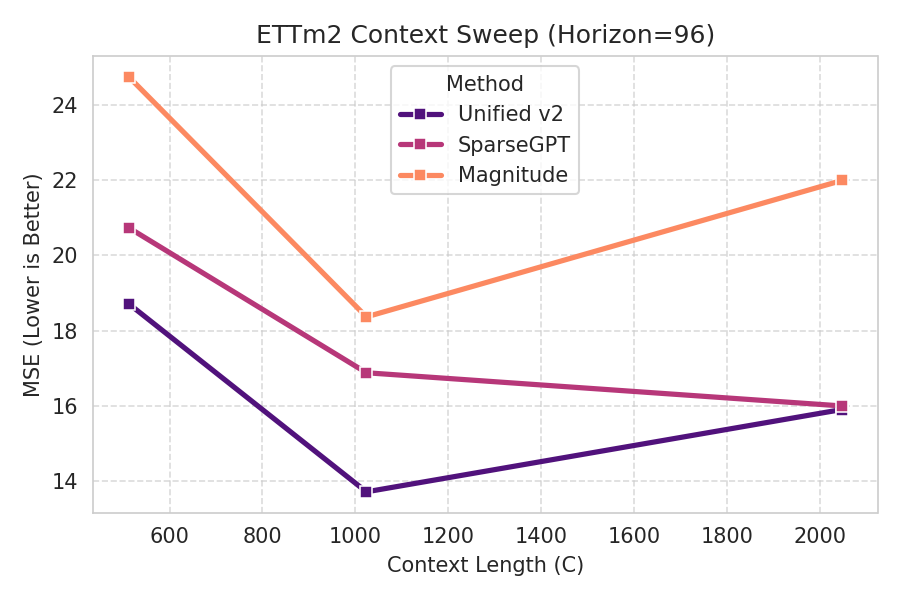
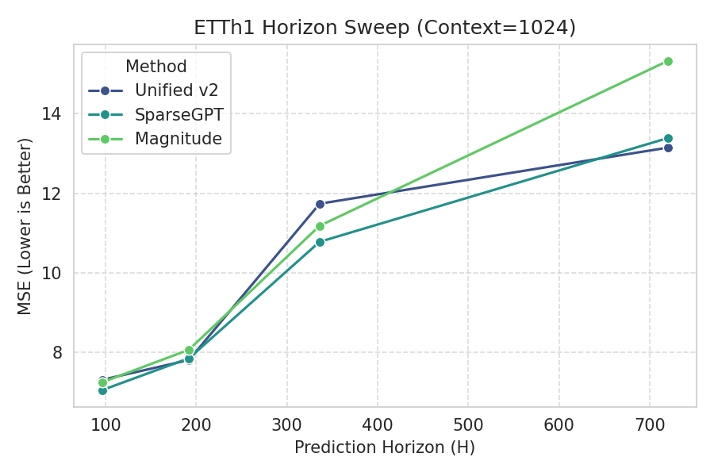
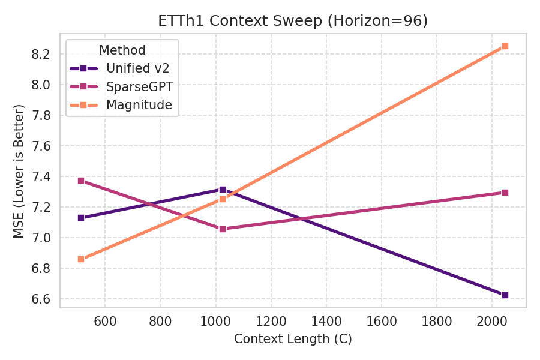
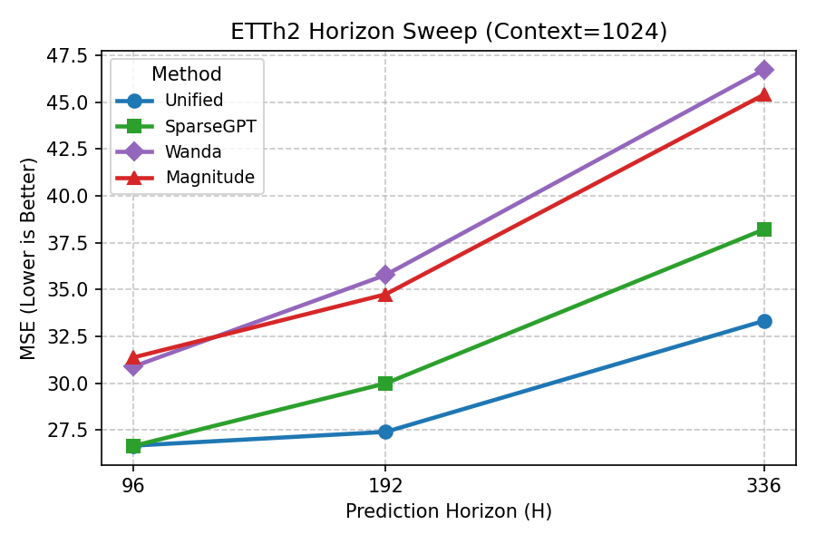
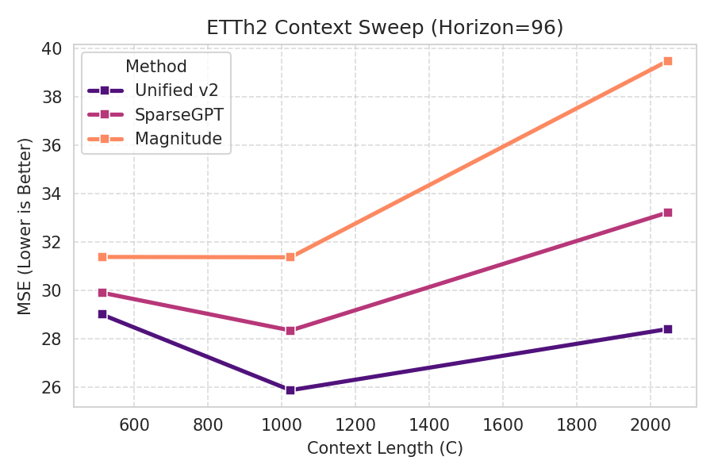

# Unified v2 Pruning for Zero-Shot Time-Series (TimesFM)

This repository contains the implementation and experimental evaluation of a **pruning-time Competitive MoE** for 2:4 sparsity in TimesFM, with layer-wise expert selection across `Magnitude`, `Wanda`, `OBS`, and `SNR`-style pruning/reconstruction strategies.

## 🚀 Key Features

- **Pruning-Time MoE Routing**: Selects the pruning expert **per layer** (and `mask/refit` variant) instead of using one global pruning method.
- **Distribution-Aware Gating**: Uses activation / Gram statistics (e.g., NSR, conditioning, kurtosis) to bias routing and apply safe fallbacks.
- **Forecast-Aware Post-Pass**: Greedy multi-layer refinement on held-out windows to reduce forecast MSE after local pruning decisions.
- **Interaction Diagnostics**: Pairwise move diagnostics and pair-aware greedy hooks for analyzing non-additive layer interactions.
- **Benchmark + Plotting Tooling**: Full 144-config sweep support and updated plotting scripts/artifacts.

## 📈 Experimental Evidence

The figures below are updated from the `branch-moe-interactions` results and use the merged benchmark in `results/sweep_postpass_best_available.csv` (full all-dataset post-pass sweep plus targeted stronger ETTm2 reruns where available).

### Performance Gallery
| Dataset | MSE vs Horizon (Context=1024) | MSE vs Context (Horizon=96) |
| :--- | :--- | :--- |
| **ETTm1** |  |  |
| **ETTm2** |  |  |
| **ETTh1** |  |  |
| **ETTh2** |  |  |

## 📊 Performance Statistics (Best-Available Unified)
- **29 / 36 wins (80.6%)** vs **SparseGPT**
- **35 / 36 wins (97.2%)** vs **Wanda**
- **33 / 36 wins (91.7%)** vs **Magnitude**
- **25 / 36 best-overall** configurations across `{Unified, SparseGPT, Wanda, Magnitude}`
- Mean MSE across all 36 configs: **Unified = 16.837** vs **SparseGPT = 17.796**

## 🛠 Repository Structure

- `scripts/`:
  - `prune_unified.py`: Main pruning implementation (Competitive MoE + safety/post-pass logic).
  - `baselines.py`: Runner for Wanda, SparseGPT, and Magnitude baselines.
  - `run_sweep.py`: Orchestrator for full grid experimental sweeps.
  - `plot_results.py`: Legacy visualization script for sweep plots.
  - `generate_updated_graphs.py`: Merges updated results and regenerates repo-style plots.
  - `generate_report.py`: Word document generator for technical specifications.
- `results/`: Sweep CSVs, merged comparison CSVs, and generated performance plots.
- `research/`: Legacy logs, draft implementations, and diagnostic tools.

## 🏁 Getting Started

### 1. Installation
Ensure you have a working `micromamba` or `conda` environment with Python 3.11.

```bash
# Clone the repository
git clone <repo_url>
cd zero_shot_pruning4

# Install dependencies
pip install -r requirements.txt
```

### 2. Running a Pruning Experiment
To prune a TimesFM model with the Unified MoE pruning logic:

```bash
micromamba run -n timesfm311 python scripts/prune_unified.py \
  --csv ETDataset/ETT-small/ETTm2.csv --col OT --train_end 49152 \
  --horizon 192 --context 1024 \
  --score_mode unified --refit 1 --ridge 1e-5 \
  --max_calls_per_layer 64 --calib_select last --nf_hi 0.0 --error_power 0 \
  --safe_policy rule_v1 \
  --greedy_postpass_k 16 --greedy_postpass_steps 6 \
  --greedy_postpass_eval_windows 32 --greedy_postpass_screen_k 12 \
  --greedy_postpass_screen_min_gain 0.03 --greedy_postpass_min_step_gain 0.02 \
  --stride_test 192
```

### 3. Executing the Full Grid Sweep
To run the baseline 144-config sweep:

```bash
python3 scripts/run_sweep.py
```

To run a `Unified`-only sweep with custom post-pass flags (used for the updated branch results):

```bash
SWEEP_METHODS=unified \
SWEEP_LOG_FILE=results/unified_postpass_all_fast.csv \
SWEEP_UNIFIED_EXTRA_FLAGS=" --max_calls_per_layer 64 --calib_select last --nf_hi 0.0 --error_power 0 --safe_policy rule_v1 --greedy_postpass_k 16 --greedy_postpass_steps 6 --greedy_postpass_eval_windows 32 --greedy_postpass_screen_k 12 --greedy_postpass_screen_min_gain 0.03 --greedy_postpass_min_step_gain 0.02 --greedy_postpass_max_cands_per_layer 8" \
python3 scripts/run_sweep.py
```

### 4. Regenerating Updated Graphs

```bash
micromamba run -n timesfm311 python scripts/generate_updated_graphs.py
```

## 📜 Methodology (Algorithm Theory)

This branch implements a **pruning-time Competitive MoE** over pruning experts, not an inference-time neural MoE. The output is still a **single pruned model** (no routing overhead at inference).

### 1) Candidate Expert Set (Per Layer)
For each prunable linear layer, the algorithm builds multiple 2:4 pruning candidates:

- **Magnitude**
- **Wanda**
- **OBS-style / Gram-based**
- **SNR-biased variants**

For each expert, the controller may evaluate both:
- **`mask`** (apply sparsity mask only)
- **`refit`** (masked weights + local reconstruction/refit)

So the MoE action is:

\[
a_\ell \in \{(\text{expert}, \text{variant})\}_{\ell}
\]

for each layer \(\ell\).

### 2) Distribution-Aware Layer Features (Gate Inputs)
The controller computes activation- and Gram-derived features during calibration, including:

- **Noise-to-signal ratio (NSR)** / energy-band decomposition (trend / season / noise)
- **Activation kurtosis** (heavy-tail detection)
- **Gram conditioning** (e.g., high condition number / instability)
- **Diagonal CV / off-diagonal ratios** (Gram geometry quality)

These features are used to bias expert selection and to detect risky layers where local reconstruction proxies are unreliable.

### 3) Local Expert Selection (Pruning-Time MoE Routing)
The first-stage gate chooses a candidate per layer using local reconstruction/validation metrics, with **layer-local** (not dataset-global) priors and safeguards.

Conceptually:

\[
a_\ell^{(0)} = \arg\min_{a \in \mathcal{A}_\ell} \; \mathcal{L}^{\text{local}}_\ell(a) + b_\ell(a; \phi_\ell)
\]

where:
- \(\mathcal{L}^{\text{local}}_\ell(a)\) is the local reconstruction proxy for candidate \(a\)
- \(b_\ell(\cdot)\) is a feature-driven bias/penalty using layer statistics \(\phi_\ell\)

### 4) Risk-Aware Safety Overrides
Some layers contribute disproportionately to forecast error despite looking good locally. The branch adds a **safety policy** that detects risky layers from distribution features and reverts them to safer expert/variant choices when locally competitive.

This addresses cases like:
- noisy `qkv/ff0` layers (prefer more robust choices)
- ill-conditioned `ff1` / output projection layers (refit instability)

### 5) Forecast-Aware Greedy Post-Pass (Task-Level Correction)
After layerwise pruning, the branch runs a **budgeted greedy post-pass** on a held-out subset of forecast windows:

1. Rank risky candidate overrides (screened top-K)
2. Evaluate one-layer forecast gain
3. Apply the best move
4. Repeat for a small number of steps

This directly optimizes forecast MSE and corrects non-additive mistakes from local routing.

\[
\Delta_i = \text{MSE}(S) - \text{MSE}(S \cup \{i\})
\]

Greedy applies the move with the largest positive \(\Delta_i\) under a step budget.

### 6) Interaction Diagnostics (Pairwise Non-Additivity)
Layer decisions interact through residual connections and downstream activations, so gains are not additive:

\[
\Delta_{i,j} \neq \Delta_i + \Delta_j
\]

This branch includes pairwise diagnostics to estimate **synergy/conflict** between moves using:
- prediction-delta overlap proxies
- optional exact pair evaluations on a small screened set

This is used for pair-aware greedy scoring and failure analysis on hard regimes (especially `ETTm2`).

### 7) Why This Is Different from Prior Methods
- **SparseGPT / Wanda / Magnitude** choose one pruning rule globally (or per-layer without task-aware MoE control).
- This branch treats pruning as a **meta-selection problem** over multiple experts.
- It combines:
  - local reconstruction quality,
  - activation distribution statistics,
  - and forecast-level post-pass corrections.

### 8) Deployment Property
Despite the MoE terminology, deployment remains simple:
- prune once,
- save one sparse model,
- run inference without any runtime MoE router.

---
*Key result files:* `results/sweep_postpass_best_available.csv`, `results/merged_unified_postpass_fast_vs_baselines.csv`, `results/ettm2_best_available_vs_baselines.csv`.
